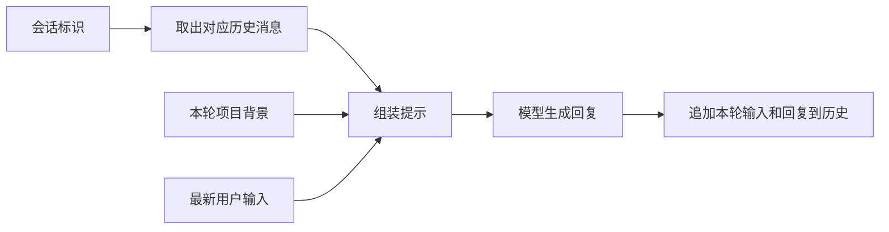

**第 12—14 讲学习记录：长上下文、摘要与动态记忆**

> 资料状态（2026-10-04）：本文保留历史分析与结论，课名和时间点可用于回看原视频。课程 OCR、字幕、截图、脚本及来源清单已清理；见 [保留资料说明](../README.md)。当前功能与操作以主 README 为准。

学习日期：2026-10-03。主要结论是：先明确当前目标，选择与目标有关的历史，保留可支持后续行动的信息，再组合最新问题和仍然有效的约束。摘要质量要看后续任务能否正确继续，而不能只看文字是否简短、结构是否齐全。

学习阶段结合 `2.6.0` 梳理采用建议，并提供一份[上下文保留摘要提示词](CONTEXT_RETENTION_PROMPT.md)。后续已按用户确认的双入口计划接入 `2.8.0` 交接模式：完整历史分块、逐阶段核验、上下文/参考快照及共享预算，见[交接模式说明](../../HANDOFF_WORKFLOW.md)。下方分析保留学习阶段的范围；实际实现不对旧记录做关键词筛选或静默裁剪。

现已根据三讲继续落地 `2.8.1`：末尾有效约束重申、行动项的负责人/时间关系/依赖原文校验及本轮任务绑定。此次改进、课程画面依据及 275 项离线验收见[交接改进记录](HANDOFF_IMPROVEMENTS.md)。下文的首次学习阶段记录与效果边界保留，不将固定替代摘要当作真实质量提升证据。

**材料与核验方式**

| 课程 | 原视频时长 | 本次阅读材料 |
| --- | --- | --- |
| 第 12 讲：长上下文与对话式提示设计 | 4 分 54.300 秒 | 完整字幕 OCR 稿、屏幕文字与原图 |
| 第 13 讲：摘要提示词保留关键上下文 | 4 分 44.331 秒 | 完整字幕 OCR 稿、屏幕文字与原图 |
| 第 14 讲：LangChain 记忆注入动态上下文 | 5 分 03.019 秒 | 完整字幕 OCR 稿、屏幕文字与原图 |

三段视频合计约 14 分 42 秒。有内嵌字幕，没有独立字幕轨。本次通读已有的三讲完整 OCR 稿，重新计算原视频 SHA-256，确认均与原提取清单一致；重新提取并查看了 11 张关键画面。证据清单记录来源、请求时间与图像摘要；截图时间是 FFmpeg 按指定秒数定位后的近似时间。

OCR 有错字，未对音轨逐字转写，也未执行课程 Notebook 或调用真实模型。下文明确区分课程展示、对代码的静态判断及项目建议。视频中的安装命令、API 配置与示例任务作为课程材料阅读，不作为当前操作指令；本次未读取 `.env`、安装依赖或修改优化器业务代码。

**第 12 讲：让每轮输入接上同一个任务**

课程在约 01:25—02:21 提出三个要点：引用已讨论内容以建立衔接；重申当前意图以防目标漂移；约定回复的语气、细节和格式。

约 02:30—03:31 的工作流程是“筛选相关历史 → 总结或压缩 → 注入新提示 → 重申约束”，见03:20 原图。

应用时，应围绕最新问题选择历史，例如排障保留已做检查及结果，规划保留里程碑、依赖和已确认决定。明确的权限、否定条件、例外、顺序、路径及输出格式仍需保留原始依据。用户后续明确修改某项要求时更新该项，不能让旧摘要继续覆盖新要求；没有被修改的要求继续生效。这些是本项目的采用原则，不能仅靠反复强调语气来保证。

**第 13 讲：摘要结构由后续用途决定**

课程用同一输入比较三种提示词：

| 形式 | 要求保留的内容 | 主要用途 |
| --- | --- | --- |
| 简短概述 | 3—5 句中立概括 | 快速了解文本主题 |
| 会议记录 | 概述、关键决定、行动项、风险或阻碍；负责人仅在原文提及时保留 | 接续协作和行动 |
| 面向后续对话的摘要 | 目标/意图、重要事实与偏好、已作决定、未决问题/后续事项、时间敏感信息 | 后续继续同一任务 |

字段依据见01:52 会议记录模板及02:08 记忆摘要模板。课程随后在客服退款、团队站会与项目发布三个样本上生成并打印三种结果；未展示以后一轮任务为目标的系统化评测。因此不能据此断言某种模板稳定最好。

一个具体问题出现在发布会议示例。原文说拟将发布推迟到 12 月 1 日，需要申请产品负责人的批准；还说要在下周二之前安排完整测试计划评审，见02:12 原文。03:04 摘要仍保留了发布日期待批，但把评审写成了安排在下周二举行。安排工作的期限不等于评审举行的日期，也不能据此确认排期已经完成。即使摘要分成正确的五个栏目，仍可能改变事件状态和时间关系。

另一个核验细节：01:07—01:16 的字幕称温度设为 `0`，但01:07 代码画面实际为 `temperature=0.2`。不把配音表述当作代码参数，也不把单个温度值当作可靠性的保证。

项目采用时，应保留“已确认 / 建议 / 待批准 / 待确认 / 已失效”等状态，并给关键事实、约束和日期附上可定位的原文依据。日期缺少年份或相对日期缺少基准时明确保留不确定性；摘要里的模型建议不能自动变成用户已确认的事实。

**第 14 讲：历史消息和动态背景分别管理**

演示链的组成可以概括为：

具体代码使用 `session_store[session_id]` 保存 `InMemoryChatMessageHistory`，通过 `MessagesPlaceholder("chat_history")` 注入历史；当前项目背景来自 `dynamic_context`，最新问题来自 `input`。`RunnableWithMessageHistory` 负责载入及追加历史。依据见01:37 存储、02:23 模板、02:57 包装及调用。

这段演示的实际范围需要分清：

- 字典与消息对象保存在进程内存，重新启动程序不会自动恢复；按不同 ID 存取历史，仅证明示例中的消息分开保存。
- 在课程配置中，`input_messages_key="input"` 指定了历史要追加的用户内容；整个 `dynamic_context` 没有作为独立背景快照自动入库。它每轮由调用方重新提供，模型回复中可能包含其片段。此判断来自课程代码、04:41 打印的历史，并与本地源码及[官方源码](https://github.com/langchain-ai/langchain/blob/master/libs/core/langchain_core/runnables/history.py)的输入取值和历史追加逻辑交叉核对。
- 未展示自动摘要、相关性检索、长期记忆、会话访问权限验证或过期清理。把历史重新放入模型输入，不会改变模型参数。
- 历史中既有用户输入，也有模型回复；曾生成的建议和错误仍是模型输出，需要保留来源与状态。

接口也需要重新核对。当前项目安装的 `langchain-core` 元数据为 `1.6.6`；本地包装器源码（本地安装包内路径：`langchain_core/runnables/history.py:324`）标记 `RunnableWithMessageHistory` 自 `1.3.3` 弃用，本地内存历史源码（本地安装包内路径：`langchain_core/chat_history.py:215`）标记 `InMemoryChatMessageHistory` 自 `1.6.4` 弃用，均指向 `2.0.0` 移除。这是对当前安装文件的静态核对，未完成运行兼容性验证。[官方短期记忆文档](https://docs.langchain.com/oss/python/langchain/short-term-memory)介绍按线程管理状态、checkpointer、历史裁剪和摘要；未来引入完整 agent 会话时可以评估这些接口。当前工具不需要仅为学习课程就增加该框架。

**对应现有提示词优化器的采用建议**

本次重新查看了当前代码：[`_request_payload()`](../../optimizer_engine.py)（记录时第 184 行）保留完整 `original_request` 和本次采用的 `layer_decisions`；生成、修复和评审复用这份材料。当前[启动器](../../launcher.py)（记录时第 119 行）每次接收新需求并发起独立运行，历史报告用于查看，没有自动变成下一次的聊天历史。这些结论以本次代码为依据。

| 场景 | 适合采用的设计 |
| --- | --- |
| 当前一次优化及有限修复 | 继续传递原始需求和已选补充；结构化摘要只作辅助，不替代原文核对 |
| 将来增加“继续修改这份提示词” | 按任务维护原始需求、当前候选、已确认补充、有效约束、本轮修改意图与未决问题；明确新建任务和继续当前任务 |
| 将来出现很长的对话或材料 | 先制定输入预算，再选择相关历史；旧历史摘要与最近轮次结合，重要约束保留原文证据 |
| 将来需要跨重启恢复 | 明确保存哪些状态、如何更新和删除、如何定位来源；不要自动将所有旧报告都加入新任务 |

例如第一次要求“只读检查并输出 JSON”，随后要求“再简洁些”，继续修改时应仍保留只读和 JSON；用户明确说“改为 Markdown”时，只更新输出格式。旧候选里模型自行添加的角色或操作要求，不能仅因被写进历史就成为有效约束。

采用前可用同一组输入比较“完整历史、简单摘要、结构化摘要”三种方式。关键验收项应包括约束保留、建议和决定的区分、日期及负责人正确性、是否正确落实最新修订、任务之间是否串用信息，以及下游问题是否能正确回答；同时记录输入长度、摘要调用成本与总成本。此处是后续评测设计，本次没有运行模型评测，也没有声称节省 token 或提高准确率。
